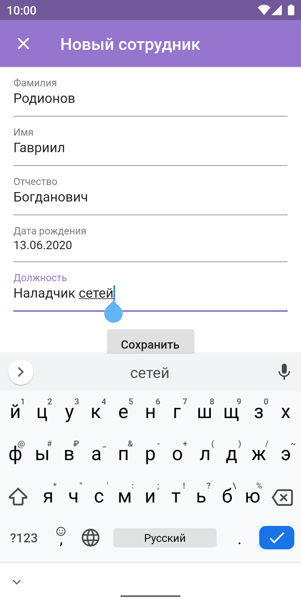
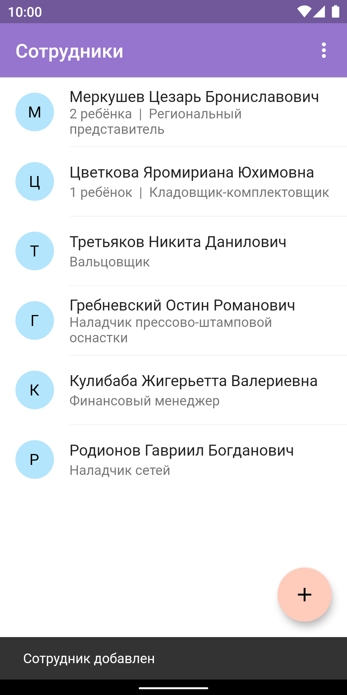

# employees

Demo Flutter application. Works on Android and iOS

## Features

* Displaying list of employees
* Adding new employee
* Displaying employee details and children
* Adding new child to an employee
* Forms validation
* Persisting data in local database

## Screenshots

## Packages used
* [provider](https://pub.dev/packages/provider) for accessing state
* [intl](https://pub.dev/packages/intl) for dates and words formatting
* [moor](https://pub.dev/packages/moor) and [moor_flutter](https://pub.dev/packages/moor_flutter) for working with local SQLite database
* [build_runner](https://pub.dev/packages/build_runner) and [moor_generator](https://pub.dev/packages/moor_generator) for code generation
